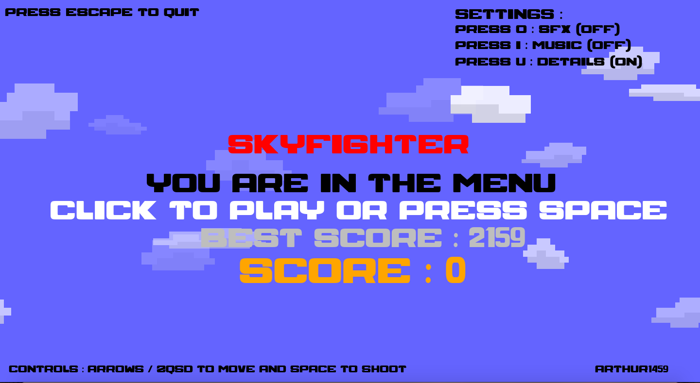
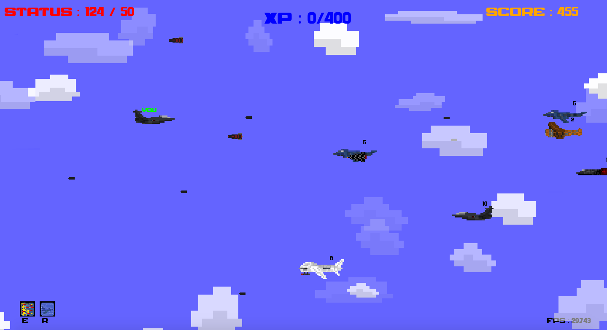
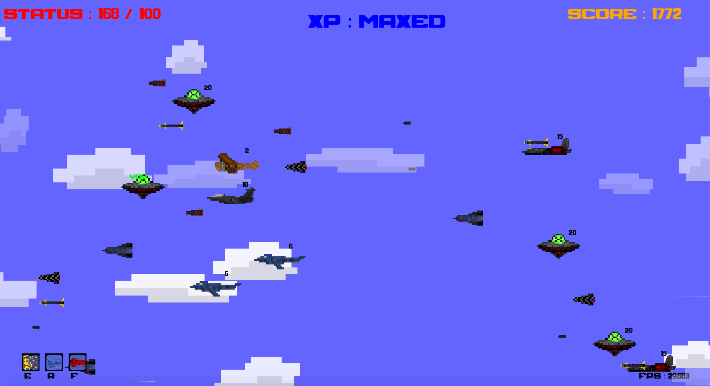

# SkyFighter
Python Arcade Game using Pygame. 

## How to setup and Play

First make sure you have python 3.9+ installed.
Then install "pygame" library. (in bash : 'pip install pygame')

When you have python and pygame, find :
  - on mac : Start.command
  - on Other : main.py

and run it.

The game should be launched !

## Screenshots

